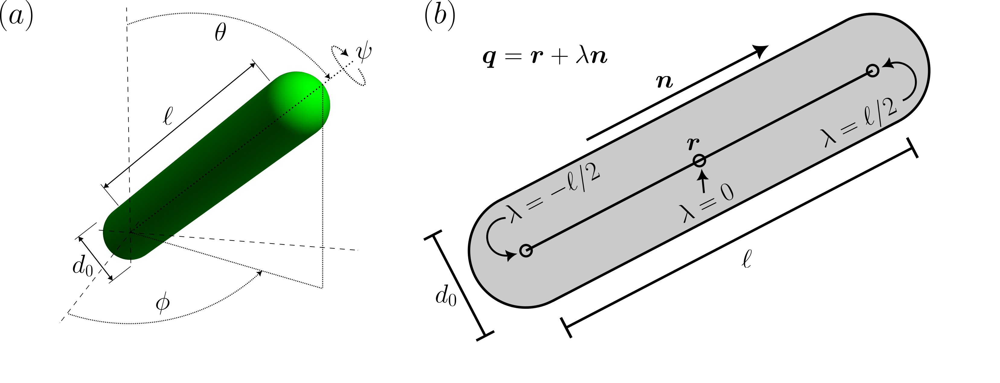
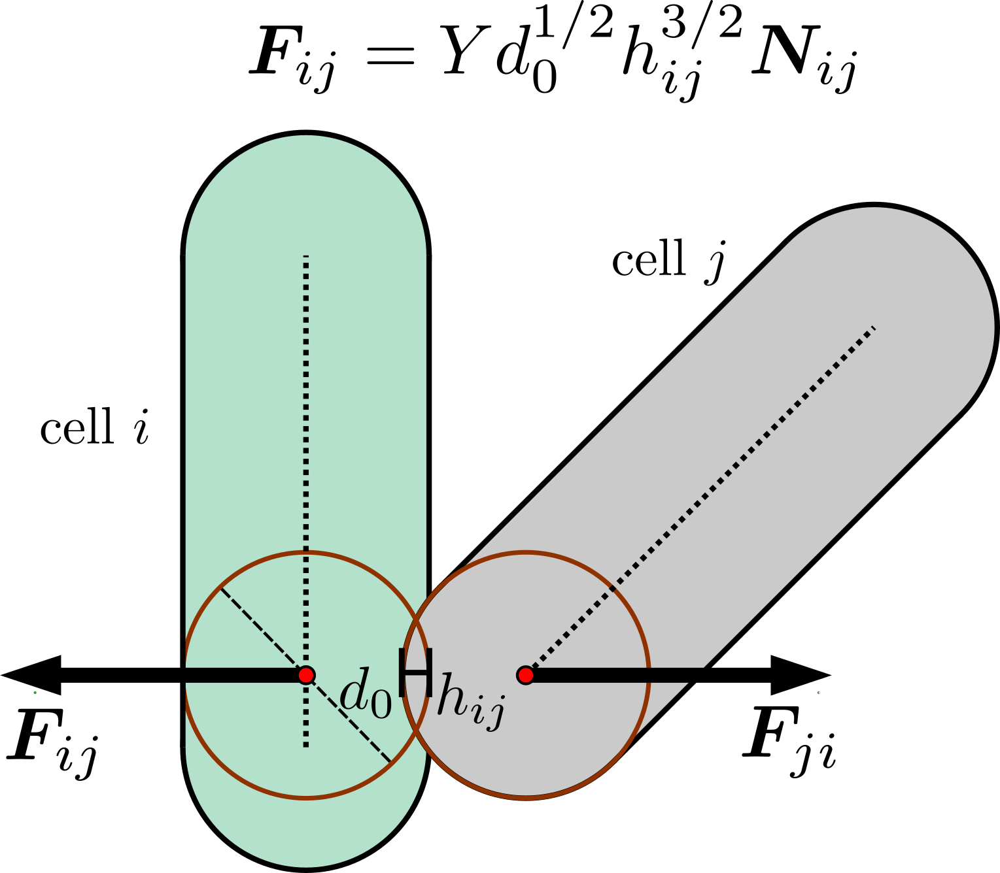
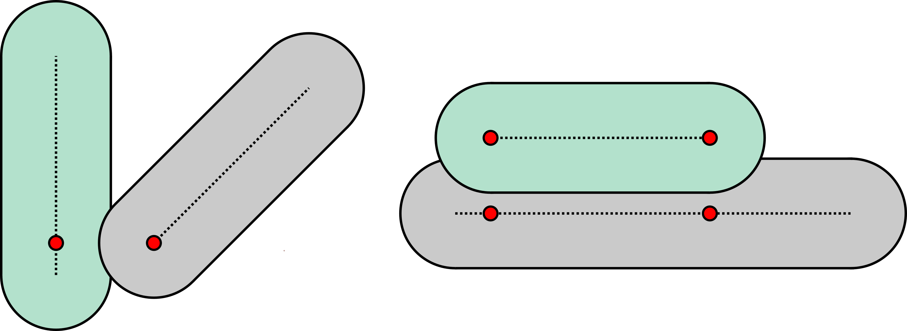
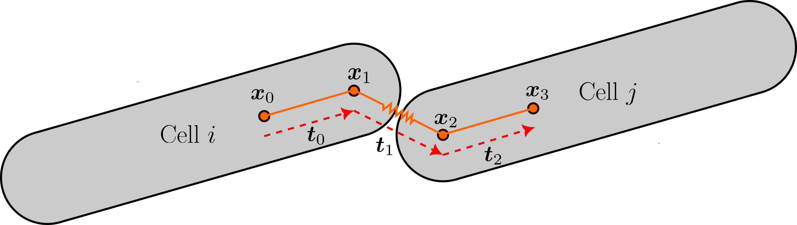
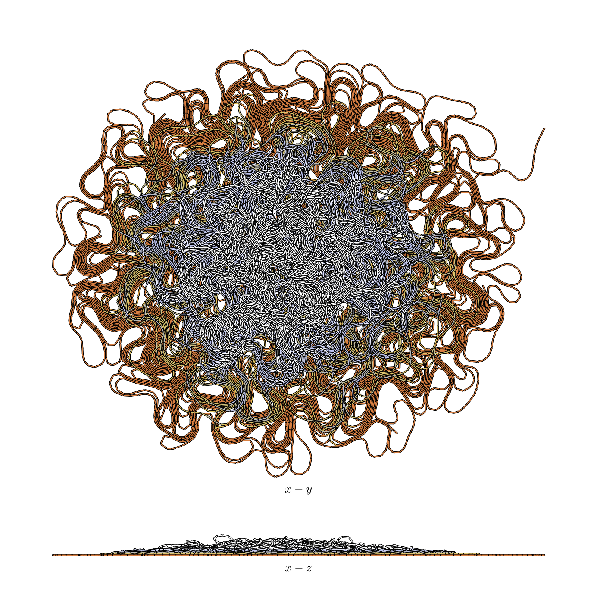
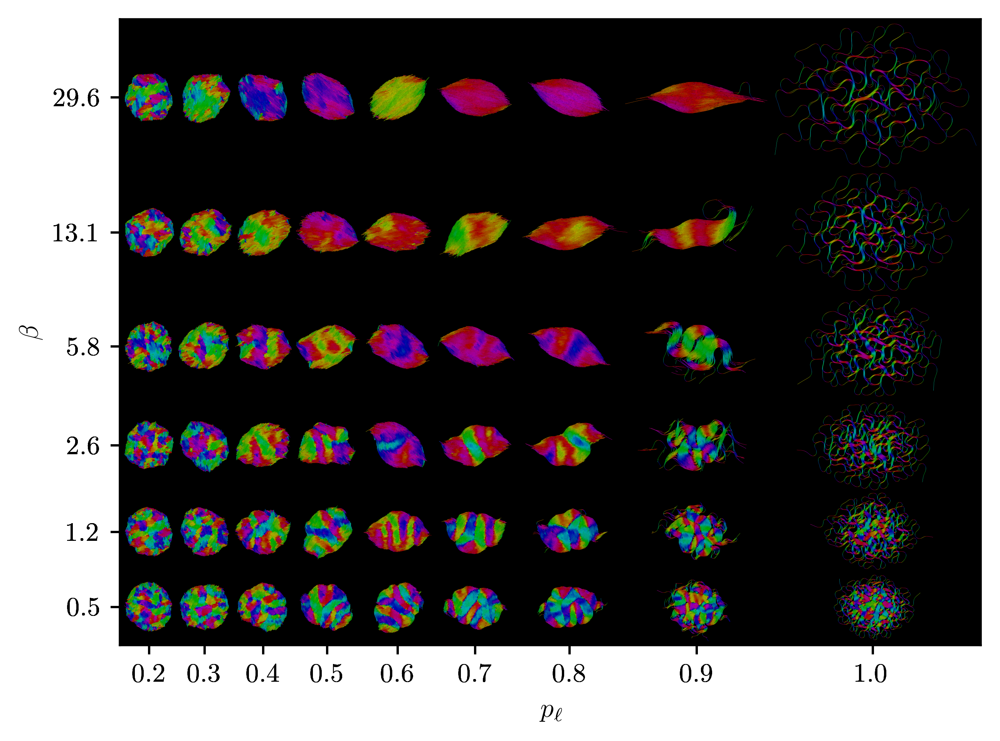

- [BiofilmPhageDES](#biofilmphagedes)
  * [Introduction](#introduction)
  * [More code details](#more-code-details)
  * [Documentation](#documentation)
  * [Compilation](#compilation)
  * [Files](#files)
  * [Results](#results)
  * [References](#references)

# BiofilmDES

*Still under construction! Check back soon for the latest details :)*

## Introduction

This repo contains a simulation framework for a discrete element simulation of a bacterial colony and bacteriophage (phage). The susceptible bacteria are represented as rod shaped bacterium such as Escherichia coli and the phage are based on tailed phage such as T4, although in the simulations this are currently point particles for simplicity. Spherical bacteria may also be included.

The biofilm component of the code is strongly based on ref. [1]. The dynamics are assumed to be overdamped due to the low Reynold number environment and interactions between bacterium are based on Hertzian contact forces. The code extends previous work to include novel features, such as elastic links between dividing bacterium. This allows for simulations of chaining bacterial colonies, and also allows us to interpolate between non-chaining and fully chaining colonies. I discuss many aspects of altering the chaining interaction in detail in my thesis, but for general users, the take home is that simple changes to cell-cell interactions can have quite profound influences on the evolution of the colony.

<!-- Work before in [3] used growing, flexible, elastic rods to achieve qualitatively similar patterns seen in chaining Escherichia coli and Bacillus subtilis.  -->


<!-- The second important aspect is to include the presence and effect of phage. Hopefully, spontaneous channel formation will provide an interesting topology for the phage to infect. -->

## Rod shaped interactions

The 3D implementation of the rods and parameterisation used for evaluating where the closest points on the line segments are is shown below.

<!--  -->


An example of how Hertzian forces between spherocylinders are represented is displayed below.

<!--  -->


The method of applying the interaction between rods is based on two elastic spheres is demonstrated. The implementation of parallel interactions is shown below, but this is likely to be updated in the future!

 <!--  -->
 

<div style="page-break-after: always"></div>

## More code details
Euler method with basic updating currently used for simplicity but higher order methods will be implemented later. The collision detection is based on finding the distance betweeen line segments in 3D from [4,5] and computing the Hertzian interaction as in [1] based on this overlap.

At the moment, I use a uniform grid to create linked cell lists (giving $\mathcal{O}(N)$ complexity) as due to short range interactions only a few cells need to be checked for interation with any other given cell, although Verlet lists may be more efficient for dense packing (need to check this).

Upon division, there is a chance given by the linking probability that cells will be connected by an elastic rod. This is currently drawn from a uniform distribution. The elastic rod has a bending modulus, $B$, and a compression modulus, $K$. To account for bending stiffness, there are two elements locked into the poles of the bacteria, moved inside so as not to inadvertently get caught in two bacteria overlapping. The figure below shows the set up.

<!-- <p align="center">
 
</p> -->


## Example output
### 3D
The image below is one giant chain.

<!-- <p align="center">
 
</p> -->


### 2D
My thesis primarily focussed on the effect of increaing the chaining probability from 0 to 1 and the effect on the colony morphology as a result of this. The following is the morphology phase diagram as a function of linking probability, $p_\ell$ and bending modulus, $\beta$ ($\beta$ is the non-dimensional $B$).

<!-- <p align="center">
 
</p> -->


## Documentation
The ```Doxygen``` folder contains a ```doxyconfig.conf``` file which should automatically generate documentation for this code. In the event you do not have Doxygen, I have included the generated file ```Doxygen/html/index.html```. This should open with all browsers and will display the list of files, classes, functions etc., with notes on what they do and how to use them.

## Compilation

Firstly, clone this repo using

`git clone git@github.com:roryclaydon1994/BiofilmDES.git`

This package uses CMake (v >= 3.16.0) for compilation and assumes g++ 9.3.0 or above. Tested with cmake version 3.23.0 and g++ 11.3.0 on Ubuntu 20. The instructions here rely on familiarity with terminal.

Building within the source directory will be blocked. To begin, navigate to the `Simulation` folder and create a folder called `build` here.
From terminal, in the project root we would write

`cd Simulation && mkdir build && cd build`

From here, we can compile the project without polluting our source directory. We generate the MakeFiles using cmake:

`cmake ..`

This will use the top level CMakeLists.txt from the Simulation folder, which calls the CMakeLists.txts in the sub folders recursively.

If this is successful, we should be able to compile the simulation executable using make. To do this, run

`make -j n`

where n is an integer representing the number of threads to compile with.

If successful, the project directory tree will be recreated in build, with the compiled objects mapped on to this tree. The executable can now be found in ```build/Main```. As we should still be in build, this can be run using

`./Main/main.out ${out_dir_name} $Kappa $BendRig $LinkingProb $ForceThresh $AspectRatio $GrowthRate`

Note, by default this will attempt to run with all available cores. See parallelisation section for more details.

The parameters are as follows:
* out_dir_name is the directory to write the output files to
* Kappa is the non-dim compression modulus (1 is sensible)
* BendRig is the non-dim bending modulus (again, 1 is sensible! See phase diagram for how this affects morphology in 2D)
* LinkingProb is the probability that daughter cells link together upon division (0-1).
* ForceThresh is not currently implemented so any value is fine. This will be the force threshold above which chains can break.
* AspectRatio is the final length of the cell at which it divides (3-5 is reasonable).
* GrowthRate is the rate of linear growth of a cell (non-dim units: 2e-4 is a good choice)

See my thesis for more details on exactly what these parameters do!

As many of these steps are routine, there is a `quickMake.sh` from within the `Simulation/` directory.
This will create a build directory `Simulation/build/`, create a MakeFile with CMake, make the package, and run a simple test to verify it worked!

<!-- ## Files

  ```plotting.nb```:
  Mathematica script for visualising output

  ```output_raw_data.tar.gz```:
  Small example output data for growth of a sitff linked biofilm, essentially 2D. Line 1 column headers are:\
  cell_id	length	diameter	com_vec_x	com_vec_y	com_vec_z	orientation_x	orientation_y	orientation_z *neighbours*	upper_link	lower_link\
  Delimeter is "\t".
  * cell_id: (long) unique identifier for each cell
  * length: (double) current cell length from pole to pole (note this does not include caps! end to end length is current length + diameter)
  * diameter: (double) nondimensionalised cell diameter
  * com_vec_x: (double) center of mass x coordinate (same for y,z suffix)
  * *neighbours*: comma seperated list of cell ids of potential contacts and the potential contacts' potential contacts. This is only outputted if CLOSEST is defined.
  * orientation_x: (double) cell orientation vector x component (same for y,z suffix)
  * upper_link: (long) unique identifier of the cell to which the upper end of the present cell is connected to (None if not connected). Similar for lower_link

```large_sim_high_bending_stiffness.mp4```:
  Example output for large sim (~33000 cells) for high bending stiffness ```K=1```, linking probability ```p=0.995``` and spring constant ```kappa=1.1```.

## Making movies
I've been using ```ffmpeg``` in ```bash``` to make movies by stitching together outputted ```png``` files. These are assumed to be in the ```output``` folder and have the filename pattern ```vis_biofilm_%05d.png```. An example for creating the movie and playing it is included below.

```ffmpeg -r 10 -i output/vis_biofilm_%05d.png -c:v libx264 -vf fps=25 -pix_fmt yuv420p output/vis_biofilm_nondim.mp4 && ffplay output/vis_biofilm_nondim.mp4```

## Results

<p align="center">
 
</p> -->

## Parallelisation

Force calculations are parallelised using OpenMP, although this has not really been tested for performance. I intend to add a switch to a more efficient serial implementation, OpenMP parallelisation, MPI parallelisation and a GPU implementation.

All on the way!

*Still writing :)*

## References

1. [Mechanically driven growth of quasi-two dimensional microbial colonies,\
    F.D.C. Farrell, O. Hallatschek, D. Marenduzzo, B. Waclaw,\
    Phys. Rev. Lett. 111, 168101 (2013).](https://doi-org.ezproxy.is.ed.ac.uk/10.1103/PhysRevLett.111.168101)

1.  [Intra-colony channels in E. coli function as a nutrient uptake system. \
     L. M.Rooney, W. B. Amos, P. A. Hoskisson et al.,\
     ISME J 14, 2461–2473 (2020).](https://doi.org/10.1038/s41396-020-0700-9)

1.   [Emergence of active nematics in chaining bacterial biofilms. \
     Y. Yaman, E. Demir, R. Vetter et al.,\
     Nat. Commun. 10, 2285 (2019).](https://doi.org/10.1038/s41467-019-10311-z)

1.  [Three-dimensional distinct element simulation of spherocylinder crystallization.\
    L. Pournin, M. Weber, M. Tsukahara et al.\
    Granul. Matter 7, 119–126 (2005).](https://doi.org/10.1007/s10035-004-0188-4)

1.  [A fast algorithm to evaluate the shortest distance between rods,\
    C. Vega, S. Lago,\
    Comput. Chem., 18(1), 55-59 (1994)](https://doi.org/10.1016/0097-8485(94)80023-5)

## Acknowledgements

1.  I would like to thank Aidan Brown, Tyler Shendruk and Bartlomiej Waclaw from the University of Edinburgh for many helpful discussions.
